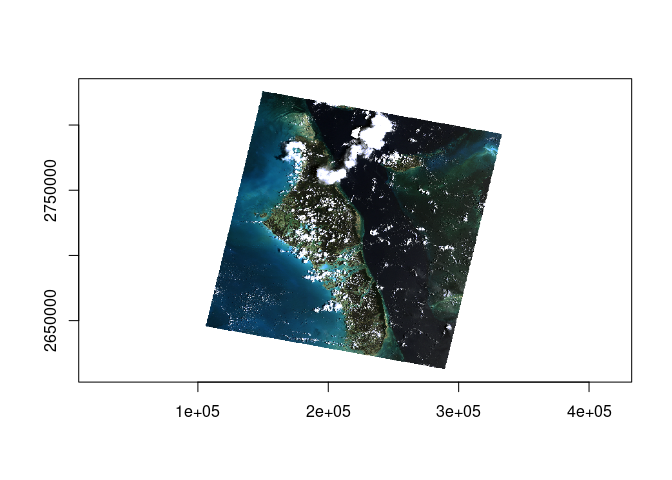
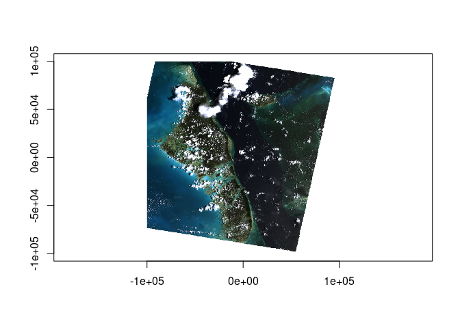

<!-- README.md is generated from README.Rmd. Please edit that file -->

# rasterio.py

<!-- badges: start -->
<!-- badges: end -->

The goal of rasterio.py is to provide an R interface to rasterio.

rasterio is a Python package that provides low-level facilities to the
[GDAL](https://www.gdal.org/), much like the R
[rgdal](https://CRAN.r-project.or/package=rgdal) did in the past. The
Python bindings have always been closer and more complete to the spirit
of the GDAL library itself than R, but rasterio itself is a
modernization of the original Python support for GDAL.

R does not have a comprehensive interface to the GDAL C++ library yet,
so this package provides a showcase of what is possible. The facilities
via Python are fine! The only real disadvantage is the dependency on
Python, there’s no obvious performance reason to avoid rasterio however.

## Installation

You can install the development version of rasterio.py like so:

``` r
# FILL THIS IN! HOW CAN PEOPLE INSTALL YOUR DEV PACKAGE?
```

## Example

This is a basic example which shows you how to solve a common problem:

``` r
library(rasterio.py)
## basic example code
file <- rgba_tif()  ## just the path to the RGBA.byte.tif of rasterio canon
dataset <- open.py(file)

dataset$bounds
#> BoundingBox(left=101985.0, bottom=2611485.0, right=339315.0, top=2826915.0)
dataset$transform
#> | 300.04, 0.00, 101985.00|
#> | 0.00,-300.04, 2826915.00|
#> | 0.00, 0.00, 1.00|
```

rasterio.py has some R helper functions for these Python reticulate
objects.

plot, extent, more to come …

WIP

``` r
plot(dataset)
```



``` r
extent.py(dataset)
#> [1]  101985  339315 2611485 2826915

(warped <- warp.py(dataset$files[1], extent = c(-1, 1, -1, 1) * 1e5, dimension = c(512, 768), projection = "+proj=aeqd +lon_0=-77.6 +lat_0=24.5", resample = "cubic"))
#> <open WarpedVRT name='WarpedVRT(/perm_storage/home/gdalbuilder/R/x86_64-pc-linux-gnu-library/4.1/rasterio.py/extdata/RGBA.byte.tif)' mode='r'>

plot(warped)
```



We can of course read from the COG!! (but, overview handling isn’t great
yet so we’re keeping examples close)
